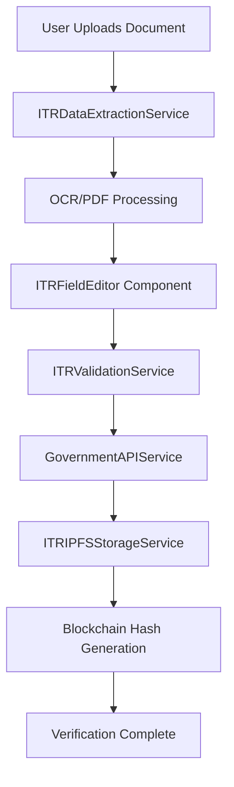

# Enhanced ITR Verification System Documentation

## Overview

The Enhanced ITR Verification System is a comprehensive blockchain-based solution for verifying Income Tax Return (ITR) documents. It provides end-to-end automation from document processing to secure storage with the following key features:

### 🔑 Key Features

1. **Automatic Data Extraction**: OCR and PDF parsing to extract all ITR fields
2. **Multi-field Form Editor**: Clean, editable interface for all ITR data fields
3. **Real-time Validation**: Comprehensive field validation with helpful error messages
4. **Government API Integration**: Official Income Tax Department portal verification
5. **Secure IPFS Storage**: SHA-256 hashing with encrypted storage on IPFS
6. **Privacy Protection**: Configurable privacy levels (PUBLIC, ENCRYPTED, SELECTIVE)
7. **Blockchain Ready**: Generates verification hashes compatible with smart contracts

---

## Architecture Overview



---

## Services Documentation

### 1. ITRDataExtractionService

**Purpose**: Extracts ITR data from uploaded documents using OCR and PDF parsing.

#### Key Methods

```typescript
class ITRDataExtractionService {
  static getInstance(): ITRDataExtractionService
  
  async extractFromFile(file: File): Promise<ExtractionResult>
  getSupportedFileTypes(): string[]
  getExtractionConfidence(data: Partial<ITRExtractedData>): number
  createSampleData(): ITRExtractedData
}
```

#### Data Structures

```typescript
interface ITRExtractedData {
  pan: string                    // Permanent Account Number
  ackNumber: string             // 15-digit acknowledgment number
  assessmentYear: string        // Format: YYYY-YY
  applicantName: string         // Full name as per PAN
  annualCertifiedIncome: string // Annual income amount
  filingDate: string           // ITR filing date
  filingStatus: string         // Filing status
  itrForm: string             // ITR form type (ITR-1, ITR-2, etc.)
  emailId: string             // Email address
  mobileNumber: string        // 10-digit mobile number
  address: string             // Complete address
  bankAccountNumber: string   // Bank account for refunds
  ifscCode: string           // Bank IFSC code
  taxableIncome: string      // Taxable income after deductions
  totalTax: string           // Total tax liability
  refundAmount: string       // Tax refund amount
  verified: boolean          // Verification status
  extractionMethod: 'OCR' | 'PDF_TEXT' | 'MANUAL'
  extractionConfidence: number
  errors: string[]
}

interface ExtractionResult {
  success: boolean
  data: Partial<ITRExtractedData>
  errors: string[]
  warnings: string[]
  extractionMethod: 'OCR' | 'PDF_TEXT' | 'MANUAL'
  processingTime: number
}
```

#### Usage Example

```typescript
const extractionService = ITRDataExtractionService.getInstance()

const fileInput = document.getElementById('file-input') as HTMLInputElement
const file = fileInput.files[0]

try {
  const result = await extractionService.extractFromFile(file)
  
  if (result.success) {
    console.log('Extracted data:', result.data)
    console.log('Confidence:', extractionService.getExtractionConfidence(result.data))
  } else {
    console.error('Extraction failed:', result.errors)
  }
} catch (error) {
  console.error('Processing error:', error)
}
```

---

### 2. ITRValidationService

**Purpose**: Provides comprehensive validation for all ITR fields with detailed error messages.

#### Key Methods

```typescript
class ITRValidationService {
  static getInstance(): ITRValidationService
  
  validateCompleteData(data: Partial<ITRExtractedData>): CompleteValidationResult
  validateField(fieldName: string, value: string): ValidationResult
  validateCriticalFields(data: Partial<ITRExtractedData>): { isValid: boolean; errors: string[] }
}
```

#### Data Structures

```typescript
interface ValidationResult {
  isValid: boolean
  errors: string[]
  warnings: string[]
  field: string
  formattedValue?: string
}

interface CompleteValidationResult {
  isCompletelyValid: boolean
  validFieldCount: number
  totalFieldCount: number
  validationScore: number
  fieldResults: { [key: string]: ValidationResult }
  criticalErrors: string[]
  suggestions: string[]
}
```

#### Usage Example

```typescript
const validationService = ITRValidationService.getInstance()

const userData = {
  pan: 'ABCDE1234F',
  ackNumber: '123456789012345',
  assessmentYear: '2024-25',
  applicantName: 'John Doe',
  annualCertifiedIncome: '500000'
}

const validationResult = validationService.validateCompleteData(userData)

console.log('Overall valid:', validationResult.isCompletelyValid)
console.log('Validation score:', validationResult.validationScore)
console.log('Critical errors:', validationResult.criticalErrors)
console.log('Suggestions:', validationResult.suggestions)

// Validate individual field
const panValidation = validationService.validateField('pan', 'INVALID_PAN')
console.log('PAN validation:', panValidation)
```

---

### 3. GovernmentAPIService

**Purpose**: Integrates with official Income Tax Department API for document verification.

#### Key Methods

```typescript
class GovernmentAPIService {
  static getInstance(): GovernmentAPIService
  
  async verifyITR(request: GovernmentVerificationRequest): Promise<GovernmentVerificationResponse>
  getConfiguration(): { mode: string; endpoints: string[] }
  async testConnectivity(): Promise<{ success: boolean; message: string; details: any }>
}
```

#### Data Structures

```typescript
interface GovernmentVerificationRequest {
  ackNumber: string
  pan: string
  assessmentYear: string
  applicantName?: string
  captchaCode?: string
  sessionId?: string
}

interface GovernmentVerificationResponse {
  success: boolean
  verified: boolean
  data?: {
    ackNumber: string
    pan: string
    assessmentYear: string
    applicantName: string
    filingDate: string
    itrForm: string
    filingStatus: string
    annualIncome: string
    taxableIncome?: string
    totalTax?: string
    refundAmount?: string
    processingDate?: string
    verificationSource: 'INCOME_TAX_PORTAL' | 'MOCK_API' | 'DEMO_MODE'
  }
  errors: string[]
  warnings: string[]
  needsCaptcha?: boolean
  captchaImage?: string
  sessionId?: string
  retryAfter?: number
  message?: string
}
```

#### Usage Example

```typescript
const governmentService = GovernmentAPIService.getInstance()

const request: GovernmentVerificationRequest = {
  ackNumber: '123456789012345',
  pan: 'ABCDE1234F',
  assessmentYear: '2024-25',
  applicantName: 'John Doe'
}

try {
  const response = await governmentService.verifyITR(request)
  
  if (response.verified) {
    console.log('Verification successful:', response.data)
  } else if (response.needsCaptcha) {
    console.log('Captcha required:', response.captchaImage)
  } else {
    console.log('Verification failed:', response.errors)
  }
} catch (error) {
  console.error('API error:', error)
}

// Test connectivity
const connectivityTest = await governmentService.testConnectivity()
console.log('API connectivity:', connectivityTest)
```

---

### 4. ITRIPFSStorageService

**Purpose**: Securely stores verified ITR data on IPFS with SHA-256 hashing and encryption.

#### Key Methods

```typescript
class ITRIPFSStorageService {
  static getInstance(): ITRIPFSStorageService
  
  async storeVerifiedITRData(
    userAddress: string,
    extractedData: ITRExtractedData,
    verificationResponse: GovernmentVerificationResponse
  ): Promise<IPFSStorageResult>
  
  generateHashes(secureData: SecureITRData): HashingResult
  async retrieveVerifiedData(cid: string): Promise<{ success: boolean; data?: SecureITRData; errors: string[] }>
  verifyDataIntegrity(data: SecureITRData, expectedHash: string): boolean
  generateQuickHash(ackNumber: string, pan: string, annualIncome: string, assessmentYear: string): string
  getConfiguration(): { enableEncryption: boolean; privacyMode: string; enableIPFS: boolean; maxStorageSizeMB: number; hashAlgorithm: string }
}
```

#### Data Structures

```typescript
interface SecureITRData {
  verifiedIncome: {
    ackNumber: string
    pan: string
    assessmentYear: string
    applicantName: string
    annualCertifiedIncome: string
    filingDate: string
    verificationTimestamp: number
  }
  
  additionalData: {
    itrForm?: string
    filingStatus?: string
    taxableIncome?: string
    totalTax?: string
    refundAmount?: string
    emailId?: string
    mobileNumber?: string
    address?: string
    bankDetails?: {
      accountNumber?: string
      ifscCode?: string
    }
    verificationSource: string
    extractionMethod: string
    processingDate: string
  }
  
  metadata: {
    userAddress: string
    timestamp: number
    version: string
    encryptionMethod: 'AES-256-GCM' | 'NONE'
    hashAlgorithm: 'SHA-256'
    privacyLevel: 'PUBLIC' | 'ENCRYPTED' | 'SELECTIVE'
  }
}

interface IPFSStorageResult {
  success: boolean
  cid?: string
  url?: string
  dataHash: string
  encryptedDataHash?: string
  errors: string[]
  warnings: string[]
  storageSize: number
  privacyLevel: 'PUBLIC' | 'ENCRYPTED' | 'SELECTIVE'
}

interface HashingResult {
  originalDataHash: string
  fullDataHash: string
  encryptedHash?: string
  algorithm: string
  timestamp: number
}
```

#### Usage Example

```typescript
const ipfsService = ITRIPFSStorageService.getInstance()

try {
  // Store verified data
  const storageResult = await ipfsService.storeVerifiedITRData(
    userAddress,
    extractedData,
    verificationResponse
  )
  
  if (storageResult.success) {
    console.log('IPFS CID:', storageResult.cid)
    console.log('Data hash:', storageResult.dataHash)
    console.log('Privacy level:', storageResult.privacyLevel)
  }
  
  // Generate quick hash for blockchain
  const quickHash = ipfsService.generateQuickHash(
    extractedData.ackNumber,
    extractedData.pan,
    extractedData.annualCertifiedIncome,
    extractedData.assessmentYear
  )
  
  console.log('Blockchain hash:', quickHash)
  
  // Retrieve data later
  if (storageResult.cid) {
    const retrievalResult = await ipfsService.retrieveVerifiedData(storageResult.cid)
    
    if (retrievalResult.success) {
      console.log('Retrieved data:', retrievalResult.data)
      
      // Verify integrity
      const isValid = ipfsService.verifyDataIntegrity(
        retrievalResult.data!,
        storageResult.dataHash
      )
      console.log('Data integrity verified:', isValid)
    }
  }
} catch (error) {
  console.error('Storage error:', error)
}
```

---

## React Components Documentation

### 1. DocumentUpload Component

**Purpose**: Handles file upload with drag-and-drop support and automatic processing.

#### Props

```typescript
interface DocumentUploadProps {
  onFileProcessed: (result: ExtractionResult) => void
  onUploadStart?: () => void
  onUploadComplete?: () => void
  onError?: (error: string) => void
  acceptedTypes?: string[]
  maxFileSize?: number // in MB
  className?: string
}
```

#### Usage Example

```jsx
import DocumentUpload from './components/itr/DocumentUpload'

function MyComponent() {
  const handleFileProcessed = (result) => {
    console.log('Extraction result:', result)
    if (result.success) {
      setExtractedData(result.data)
    }
  }

  return (
    <DocumentUpload
      onFileProcessed={handleFileProcessed}
      onError={(error) => setError(error)}
      acceptedTypes={['.pdf', '.jpg', '.png']}
      maxFileSize={10}
    />
  )
}
```

### 2. ITRFieldEditor Component

**Purpose**: Provides a comprehensive field editor with validation and formatting.

#### Props

```typescript
interface ITRFieldEditorProps {
  initialData: Partial<ITRExtractedData>
  onDataChange: (data: Partial<ITRExtractedData>) => void
  onValidationChange: (validation: CompleteValidationResult) => void
  showOptionalFields?: boolean
  readOnlyFields?: string[]
  highlightErrors?: boolean
  className?: string
}
```

#### Usage Example

```jsx
import ITRFieldEditor from './components/itr/ITRFieldEditor'

function MyComponent() {
  const [extractedData, setExtractedData] = useState({})
  const [validation, setValidation] = useState(null)

  return (
    <ITRFieldEditor
      initialData={extractedData}
      onDataChange={setExtractedData}
      onValidationChange={setValidation}
      showOptionalFields={true}
      highlightErrors={true}
    />
  )
}
```

### 3. EnhancedITRVerification Component

**Purpose**: Main component that orchestrates the entire verification workflow.

#### Props

```typescript
interface EnhancedITRVerificationProps {
  onVerificationComplete: (success: boolean, data?: any) => void
  isActive: boolean
  className?: string
}
```

#### Usage Example

```jsx
import EnhancedITRVerification from './components/EnhancedITRVerification'

function App() {
  const handleVerificationComplete = (success, data) => {
    if (success) {
      console.log('Verification completed:', data)
      // Store hash on blockchain, show success message, etc.
    }
  }

  return (
    <EnhancedITRVerification
      onVerificationComplete={handleVerificationComplete}
      isActive={true}
    />
  )
}
```

---

## Configuration & Environment Variables

### Environment Variables

```env
# ITR Service Configuration
VITE_ITR_DEMO_MODE=true                    # Enable demo mode for testing
VITE_ITR_MOCK_MODE=false                   # Enable mock API responses
VITE_ITR_API_TIMEOUT=30000                 # API timeout in milliseconds
VITE_ITR_MAX_RETRIES=3                     # Maximum API retry attempts

# IPFS Storage Configuration
VITE_ITR_ENABLE_ENCRYPTION=true            # Enable data encryption
VITE_ITR_PRIVACY_MODE=SELECTIVE            # Privacy mode: PUBLIC, ENCRYPTED, SELECTIVE
VITE_ITR_ENCRYPTION_KEY=your_key_here      # Custom encryption key
VITE_ITR_MAX_STORAGE_SIZE=5                # Max storage size in MB

# Pinata IPFS Configuration
VITE_PINATA_JWT=your_jwt_token              # Pinata JWT token
VITE_PINATA_API_KEY=your_api_key           # Alternative: API key
VITE_PINATA_SECRET_API_KEY=your_secret     # Alternative: API secret
VITE_ENABLE_IPFS=true                      # Enable IPFS storage
```

### Service Configuration

```typescript
// Get current configuration
const extractionConfig = ITRDataExtractionService.getInstance().getSupportedFileTypes()
const validationConfig = ITRValidationService.getInstance()
const governmentConfig = GovernmentAPIService.getInstance().getConfiguration()
const ipfsConfig = ITRIPFSStorageService.getInstance().getConfiguration()

console.log('Extraction supports:', extractionConfig)
console.log('Government API mode:', governmentConfig.mode)
console.log('IPFS configuration:', ipfsConfig)
```

---

## Privacy & Security Features

### 1. Privacy Levels

- **PUBLIC**: No sensitive personal data stored (email, phone, address excluded)
- **ENCRYPTED**: Entire data structure encrypted with AES-256-GCM
- **SELECTIVE**: Only sensitive fields encrypted, core verification data in plain text

### 2. Hashing Strategy

```typescript
// Core verification hash (for blockchain)
const coreHash = keccak256(ackNumber + pan + annualIncome + assessmentYear + timestamp)

// Full data hash (for integrity verification)
const fullHash = sha256(JSON.stringify(completeData))

// Encrypted data hash (for encrypted storage verification)
const encryptedHash = sha256(encryptedData)
```

### 3. Encryption Implementation

```typescript
// AES-256-GCM encryption with random IV
const encrypt = (data: string, key: string) => {
  const iv = crypto.randomBytes(16)
  const cipher = crypto.createCipher('aes-256-gcm', key)
  cipher.setAAD(Buffer.from('ITR_VERIFICATION'))
  
  let encrypted = cipher.update(data, 'utf8', 'hex')
  encrypted += cipher.final('hex')
  
  const authTag = cipher.getAuthTag()
  return iv.toString('hex') + ':' + encrypted + ':' + authTag.toString('hex')
}
```

---

## Error Handling & Troubleshooting

### Common Error Scenarios

#### 1. Document Processing Errors

```typescript
// Handle extraction errors
if (!result.success) {
  switch (result.extractionMethod) {
    case 'PDF_TEXT':
      console.error('PDF parsing failed:', result.errors)
      // Suggest: Try with image version or manual entry
      break
    case 'OCR':
      console.error('OCR processing failed:', result.errors)
      // Suggest: Use higher quality image or PDF version
      break
  }
}
```

#### 2. Validation Errors

```typescript
// Handle validation errors
if (!validation.isCompletelyValid) {
  validation.criticalErrors.forEach(error => {
    console.error('Critical error:', error)
    // Display to user with correction suggestions
  })
  
  // Show suggestions
  validation.suggestions.forEach(suggestion => {
    console.log('Suggestion:', suggestion)
  })
}
```

#### 3. Government API Errors

```typescript
// Handle API verification errors
if (!response.verified) {
  if (response.needsCaptcha) {
    // Show captcha to user
    showCaptchaDialog(response.captchaImage, response.sessionId)
  } else {
    // Handle other errors
    console.error('Verification failed:', response.errors)
    
    if (response.retryAfter) {
      console.log(`Retry after ${response.retryAfter} seconds`)
    }
  }
}
```

#### 4. IPFS Storage Errors

```typescript
// Handle storage errors
if (!storageResult.success) {
  console.error('IPFS storage failed:', storageResult.errors)
  
  // Check if it's a size issue
  if (storageResult.storageSize > maxSize) {
    console.log('File too large, consider reducing privacy level')
  }
  
  // Check if it's a connectivity issue
  const connectivityTest = await ipfsService.testConnectivity()
  if (!connectivityTest.success) {
    console.log('IPFS connectivity issue:', connectivityTest.message)
  }
}
```

---

## Performance Optimization

### 1. Large File Handling

```typescript
// Process large files in chunks
const processLargeFile = async (file: File) => {
  const maxSize = 10 * 1024 * 1024 // 10MB
  
  if (file.size > maxSize) {
    // Compress image before processing
    const compressedFile = await compressImage(file, 0.7)
    return extractionService.extractFromFile(compressedFile)
  }
  
  return extractionService.extractFromFile(file)
}
```

### 2. Caching Strategies

```typescript
// Cache validation results
const validationCache = new Map<string, ValidationResult>()

const getCachedValidation = (field: string, value: string) => {
  const key = `${field}:${value}`
  
  if (validationCache.has(key)) {
    return validationCache.get(key)
  }
  
  const result = validationService.validateField(field, value)
  validationCache.set(key, result)
  return result
}
```

### 3. Background Processing

```typescript
// Use Web Workers for intensive processing
const processInBackground = async (file: File) => {
  return new Promise((resolve, reject) => {
    const worker = new Worker('/workers/itr-processor.js')
    
    worker.postMessage({ file, config: extractionConfig })
    
    worker.onmessage = (e) => {
      const { success, result, error } = e.data
      
      if (success) {
        resolve(result)
      } else {
        reject(error)
      }
    }
    
    worker.onerror = reject
  })
}
```

---

## Integration Examples

### 1. Integration with Existing ITR Component

```typescript
// Replace existing ITRVerification with EnhancedITRVerification
import { EnhancedITRVerification } from './components/EnhancedITRVerification'

// In your wizard or main component
const steps = [
  { id: 'face', component: FaceVerification },
  { id: 'aadhaar', component: AadhaarVerification },
  { id: 'itr', component: EnhancedITRVerification }, // Updated component
  { id: 'zkproof', component: ZkProof }
]
```

### 2. Custom Field Configuration

```typescript
// Extend field editor with custom fields
const customFieldConfigs = [
  {
    key: 'customField1',
    label: 'Custom Field',
    placeholder: 'Enter custom data',
    type: 'text',
    required: false,
    validator: (value: string) => value.length > 5
  }
]

// Use in component
<ITRFieldEditor
  initialData={extractedData}
  onDataChange={setExtractedData}
  customFields={customFieldConfigs}
/>
```

### 3. Blockchain Integration

```typescript
// Store verification hash on blockchain
const storeOnBlockchain = async (verificationSummary: any) => {
  const contract = new ethers.Contract(contractAddress, abi, signer)
  
  const tx = await contract.storeITRVerification(
    verificationSummary.userAddress,
    verificationSummary.dataHash,
    verificationSummary.ipfsResult.cid || '',
    verificationSummary.timestamp
  )
  
  await tx.wait()
  console.log('Stored on blockchain:', tx.hash)
}

// Use in completion callback
const handleVerificationComplete = async (success: boolean, data: any) => {
  if (success && data) {
    await storeOnBlockchain(data)
  }
}
```

---

## Testing & Quality Assurance

### 1. Unit Testing Examples

```typescript
// Test extraction service
describe('ITRDataExtractionService', () => {
  it('should extract PAN from PDF', async () => {
    const service = ITRDataExtractionService.getInstance()
    const mockFile = new File(['mock pdf content'], 'test.pdf', { type: 'application/pdf' })
    
    const result = await service.extractFromFile(mockFile)
    
    expect(result.success).toBe(true)
    expect(result.data.pan).toMatch(/^[A-Z]{5}[0-9]{4}[A-Z]{1}$/)
  })
})

// Test validation service
describe('ITRValidationService', () => {
  it('should validate PAN format correctly', () => {
    const service = ITRValidationService.getInstance()
    
    const validResult = service.validateField('pan', 'ABCDE1234F')
    expect(validResult.isValid).toBe(true)
    
    const invalidResult = service.validateField('pan', 'INVALID')
    expect(invalidResult.isValid).toBe(false)
    expect(invalidResult.errors.length).toBeGreaterThan(0)
  })
})
```

### 2. Integration Testing

```typescript
// Test complete workflow
describe('ITR Verification Workflow', () => {
  it('should complete end-to-end verification', async () => {
    const extractionService = ITRDataExtractionService.getInstance()
    const validationService = ITRValidationService.getInstance()
    const governmentService = GovernmentAPIService.getInstance()
    const ipfsService = ITRIPFSStorageService.getInstance()
    
    // 1. Extract data
    const file = new File(['test content'], 'test.pdf', { type: 'application/pdf' })
    const extractionResult = await extractionService.extractFromFile(file)
    expect(extractionResult.success).toBe(true)
    
    // 2. Validate data
    const validation = validationService.validateCompleteData(extractionResult.data)
    expect(validation.isCompletelyValid).toBe(true)
    
    // 3. Government verification (mock)
    const govResponse = await governmentService.verifyITR({
      ackNumber: extractionResult.data.ackNumber!,
      pan: extractionResult.data.pan!,
      assessmentYear: extractionResult.data.assessmentYear!
    })
    expect(govResponse.verified).toBe(true)
    
    // 4. IPFS storage
    const storageResult = await ipfsService.storeVerifiedITRData(
      '0x1234567890123456789012345678901234567890',
      extractionResult.data as ITRExtractedData,
      govResponse
    )
    expect(storageResult.success).toBe(true)
    expect(storageResult.dataHash).toBeDefined()
  })
})
```

---

## Deployment & Production Considerations

### 1. Environment Setup

```bash
# Install dependencies
npm install tesseract.js pdf-parse crypto-js

# Set up environment variables
cp .env.example .env
# Edit .env with your configuration

# Build and deploy
npm run build
npm run deploy
```

### 2. Security Checklist

- [ ] Secure API endpoints with proper authentication
- [ ] Implement rate limiting for government API calls
- [ ] Use environment variables for sensitive configuration
- [ ] Enable HTTPS for all communication
- [ ] Implement proper input sanitization
- [ ] Use secure random number generation for encryption
- [ ] Regular security audits of cryptographic functions

### 3. Monitoring & Analytics

```typescript
// Add monitoring hooks
const addMonitoring = (service: string, operation: string, success: boolean, duration: number) => {
  // Send to analytics service
  analytics.track('ITR_Operation', {
    service,
    operation,
    success,
    duration,
    timestamp: Date.now()
  })
}

// Use in services
const result = await extractionService.extractFromFile(file)
addMonitoring('extraction', 'extractFromFile', result.success, result.processingTime)
```

---

## Future Enhancements

### Planned Features

1. **Multi-language Support**: OCR processing for regional language documents
2. **Batch Processing**: Handle multiple ITR documents simultaneously
3. **Advanced Analytics**: Detailed verification statistics and insights
4. **Mobile App Integration**: React Native components for mobile apps
5. **API Gateway**: RESTful API endpoints for third-party integrations
6. **Machine Learning**: Improved field detection accuracy with ML models

### Scalability Improvements

1. **Microservices Architecture**: Split services into independent deployable units
2. **Queue-based Processing**: Handle high-volume document processing
3. **CDN Integration**: Faster file uploads and downloads
4. **Database Caching**: Redis/Memcached for validation results
5. **Load Balancing**: Distribute processing across multiple instances

---

## Support & Community

### Getting Help

1. **Documentation**: Comprehensive guides and API references
2. **Examples**: Sample implementations and use cases
3. **Community**: GitHub discussions and issue tracking
4. **Support**: Professional support options available

### Contributing

We welcome contributions! Please see our contributing guidelines for:

1. **Code Style**: ESLint and Prettier configurations
2. **Testing**: Unit and integration test requirements  
3. **Documentation**: Documentation standards and templates
4. **Review Process**: Pull request and code review workflow

### License

This project is licensed under the MIT License. See LICENSE file for details.

---

*This documentation covers the complete Enhanced ITR Verification System. For specific implementation details or troubleshooting, please refer to the individual service documentation or contact our support team.*
